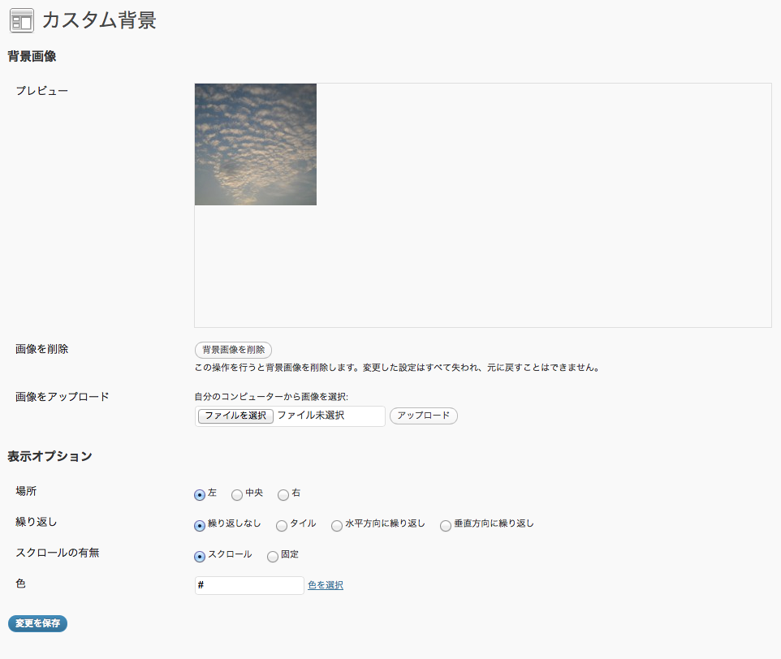

# トップページ背景画像の更新

背景画像の更新は、管理者権限で行います。
管理者権限では他の設定も変更できるので、取り扱いには注意してください。

1. 管理者権限でログインしてください。
2. 画面左側のメニューから、外観＞背景をクリックします。
3. 「カスタム背景」画面が表示されます。プレビューには現在使用中の背景画像が表示されています。

4. 「画像をアップロード」から任意の画像を選択しアップロードしてください。アップロードするとプレビューの画像が差し代わります。
あまり小さい画像を使用すると表示が汚いので、目安としては画面サイズの横幅が1000px以上のものがよいでしょう。
注意：写真は強制的に小さな正方形に切り取られてプレビューされますが、実際のトップページ背景では切り取られません。
5. 表示オプションは以下の通りにしてください。
	- 場所：左
	- 繰り返し：なし
	- スクロールの有無：スクロール
	- 色：#
6. 問題がなければ「変更を保存」ボタンをクリックします。
7. トップページを確認してください。背景画像が変更されていれば完了です。